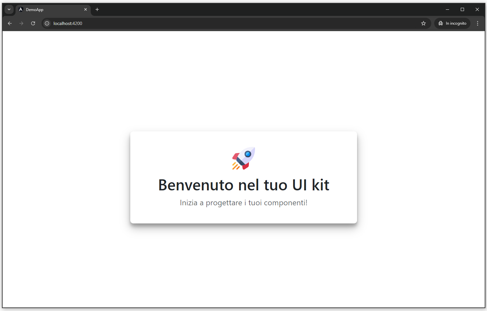

# UI Kit Abl Components

Benvenuti nella libreria **UI Kit Abl Components**! Questa libreria Angular è configurata per contenere una raccolta di componenti riutilizzabili per la creazione di interfacce utente. La libreria è affiancata da una demo app che permette di visualizzare i componenti in azione e testare le modifiche in tempo reale durante lo sviluppo.

---------------------------------------
**NB**: Questo è un boilerplate di una Libreria Angular che contiene un solo componente di Benvenuto.

**NB**: Sostituisci il nome della libreria 'ui-kit-abl' con quello che preferisci prima di pubblicare su NPM per non avere conflitti.

**NB**: La dimostrazione di pubblicazione su NPM è disponibile **QUI**: https://www.npmjs.com/package/ui-kit-abl.
---------------------------------------

## Struttura del progetto

La struttura del progetto è organizzata come segue:

```
/project
  ├── /ui-kit-abl  # Libreria Angular con tutti i componenti
  └── /demo-app                 # Applicazione demo per testare i componenti
```

### Cartella `project/ui-kit-abl`
Questa cartella contiene tutti i componenti della libreria **UI Kit Abl Components**. Ogni componente deve essere progettato per essere modulare e riutilizzabile, garantendo così una facile integrazione e flessibilità nelle applicazioni Angular.

### Cartella `project/demo-app`
La cartella `project/demo-app` contiene un'applicazione Angular che viene utilizzata per testare i componenti della libreria. Puoi usare questa applicazione per vedere le modifiche ai componenti in tempo reale mentre lavori sulla libreria.

## Requisiti

Prima di iniziare, assicurati di avere installato le seguenti dipendenze:

- **Node.js**: 18.17.0
- **Angular CLI**: 16.2.0


## Come iniziare

Segui questi passi per avviare il progetto:

### 1. Installazione delle dipendenze
Dopo aver clonato il repository, installa tutte le dipendenze necessarie:

```bash
npm install
```

**bootstrap**: "^5.3.3" (assicurati di avere Bootstrap nelle peerDependencies)
**NB**: puoi sostituire la libreria UI con quello che preferisci, nel nostro componente di esempio abbiamo utilizzato Bootstrap.

### 2. Avvio della demo-app
Per avviare l'applicazione demo e visualizzare i componenti:

```bash
ng build ui-kit-abl --watch
```

```bash
ng serve demo-app --port=4200

```




Ora puoi visitare `http://localhost:4200` nel tuo browser per vedere l'app demo.

### 3. Modifica e build della libreria
Per modificare i componenti della libreria e vedere le modifiche in tempo reale nella demo-app, utilizza il seguente comando per costruire la libreria in modalità **watch**:

```bash
ng build ui-kit-abl --watch
```

Questo comando compila la libreria e tiene traccia delle modifiche, così ogni modifica ai componenti verrà automaticamente riflessa nell'app demo.

## Comandi utili

### Build della libreria
Per effettuare una build manuale della libreria, puoi eseguire il seguente comando:

```bash
ng build ui-kit-abl
```

## Struttura della libreria

I componenti della libreria sono situati nella cartella `project/ui-kit-abl`. Ogni componente è strutturato in moduli separati, facilitando l'importazione e l'utilizzo selettivo dei componenti all'interno di altre applicazioni Angular.

## Pubblicazione su npm

Per pubblicare la tua libreria su npm, segui questi passaggi:

### 1. Esegui la Build della Libreria

Prima di pubblicare, assicurati di aver eseguito la build della tua libreria. Spostati nella cartella principale del progetto e utilizza il seguente comando:

```bash
ng build ui-kit-abl
```

### 2. Naviga nella Cartella di Distribuzione

Una volta completata la build, naviga nella cartella di distribuzione della tua libreria. Puoi farlo con il comando:

```bash
cd dist/ui-kit-abl
```

### 3. Accedi a npm

Assicurati di essere autenticato nel tuo account npm. Se non sei già autenticato, esegui il seguente comando:

```bash
npm login
```

Ti verrà chiesto di inserire il tuo nome utente, password e email associati al tuo account npm.

### 4. Pubblica il Pacchetto

Ora puoi pubblicare la tua libreria su npm con il seguente comando:

```bash
npm publish
```

### NB
Assicurati che il tuo file `package.json` contenga tutte le informazioni necessarie (nome, versione, keywords, etc.) prima di pubblicare. Ad ogni pubblicazione è necessario aggiornare il numero della versione, diversamente, la pubblicazione NPM andrà in errore.
**Esempio**: (Pubblicazione 1): versione: 1.0.1, (Pubblicazione 2): versione: 1.0.2.

### 5. Installazione della Libreria in un Nuovo Progetto

Dopo la pubblicazione, puoi installare la tua libreria in un nuovo progetto Angular utilizzando npm. Esegui il seguente comando nel terminale del nuovo progetto:

```bash
npm install ui-kit-abl
```

### Nota

Per ulteriori dettagli sull'uso della libreria, consulta il file `README.md` all'interno della cartella `project/ui-kit-abl`.


Grazie per aver utilizzato la libreria **UI Kit Abl Components**!
